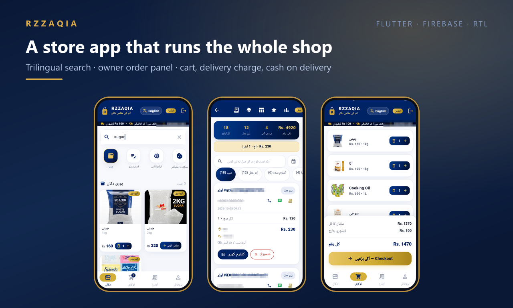
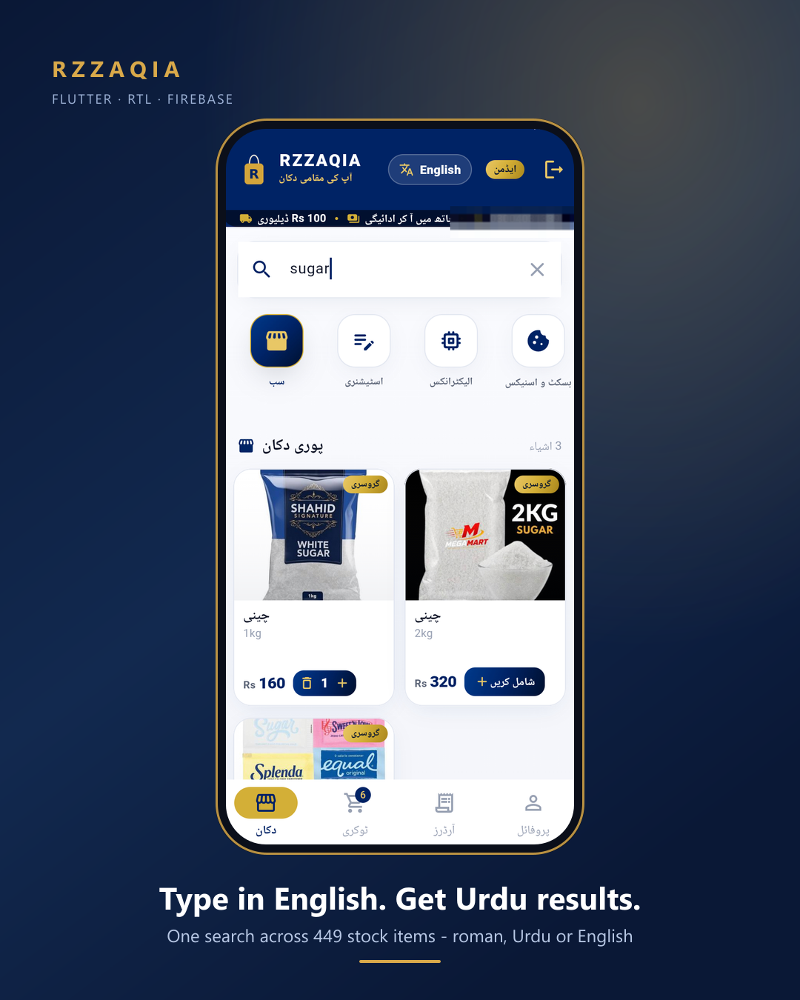
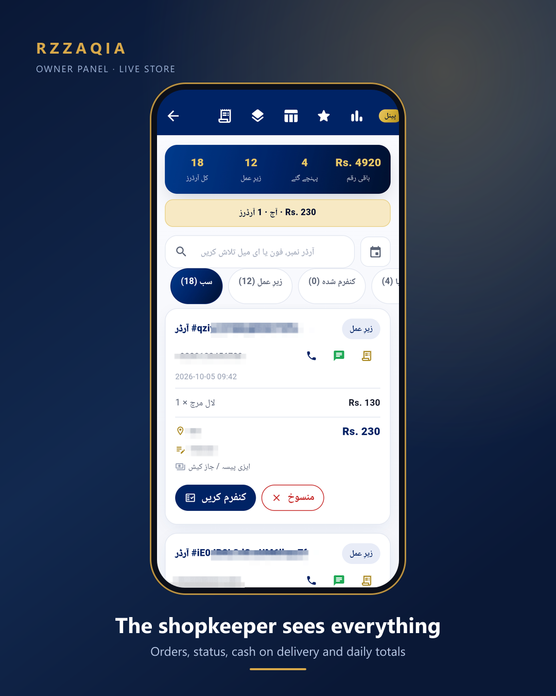
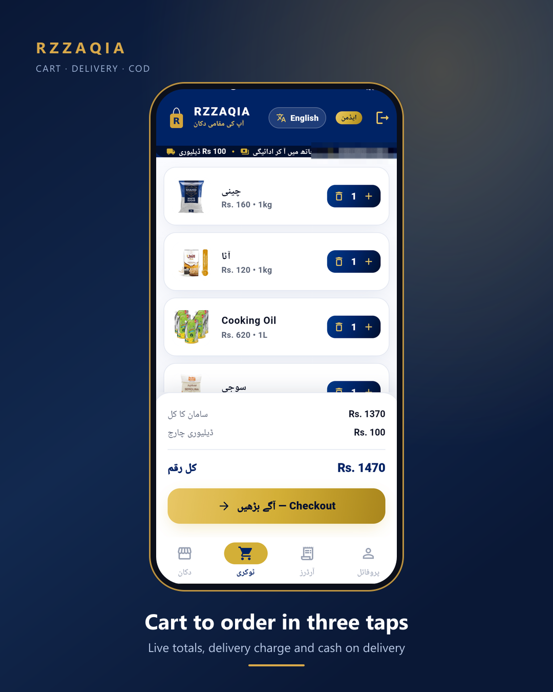
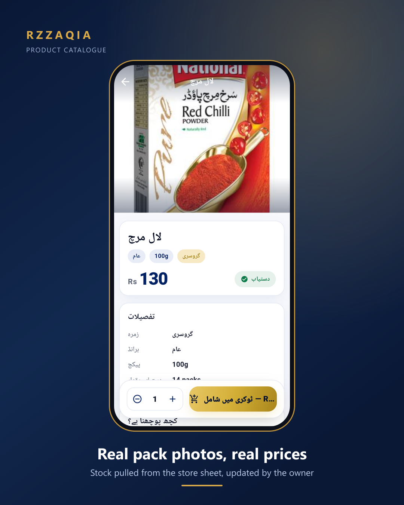

# Rzaqia Store

I own a small departmental store. I also build Flutter apps. This is not a demo
project made for a portfolio: I built it for my own shop, and the products,
prices and pack photos in these screenshots are my real stock. 449 items are
loaded in it right now, taken from the list I keep for the shop.

## Why I built it

Before this app, customers phoned the shop all day to ask whether we have
something and what it costs. Orders went into a notebook. Nothing could be
searched afterwards, and the stock knowledge sat in one person's head.

What gets sold to small shops here is either a monthly subscription for a
system with fifty features a shop like mine will never open, or nothing at all.
So I built the narrow thing I needed.

## The customer side

Language switch between English, Urdu and Roman Urdu. Urdu is right-to-left, so
the layout has to flip properly, not just the words. Search matches all three
languages: "sugar", "چینی" and "cheeni" return the same product. Product pages
use photos of the actual packs that are on our shelves. Then cart, delivery
charge, and a cash-on-delivery order in a few taps.

## The shop side

Same app, different screen. Incoming orders land in a list, the owner opens one
and moves it from pending to processing to delivered, and can see the day's
total. No laptop, no admin website to keep open. The phone in his pocket is the
dashboard.

Prices and stock come from a small editable content source that I update
myself, so changing a price does not need a new build. The orders you see in the
screenshots are ones I entered myself while building and testing the app.

## Screens

| Search in any language | Owner's order list |
|---|---|
|  |  |

| Cart and checkout | Product page |
|---|---|
|  |  |

## Stack

Flutter and Dart for the app. Firebase for auth, live data and the order flow.
The three-language layer including the RTL handling is something I wrote
myself rather than pulling a package in.

## About the code

This repo has the write-up and the screenshots, no app source. The reason is
ordinary: it holds my shop's real product list and prices, so the full code
stays in a private repo. If you want to look at the code before hiring me, ask,
and I will walk you through it over chat, screen by screen.

## Where it stands

The app is not on the Play Store, and no customer orders through it yet. It runs
on my own phone as my working tool, and it is the base I build client apps on.
I am writing it here so the screenshots are not read as more than they are.

## Still on my list

Two things are visible in the screenshots above, so I would rather mention them
than let you find them. The tagline in the home header overflows on smaller
screens, and the add-to-cart button on the product page clips its own label
(see the last screenshot). Both are layout fixes and go into the next build.
There is no offline mode yet either.

## If you want an app like this for your business

I take this work on Fiverr: https://www.fiverr.com/s/vbbbDZz
